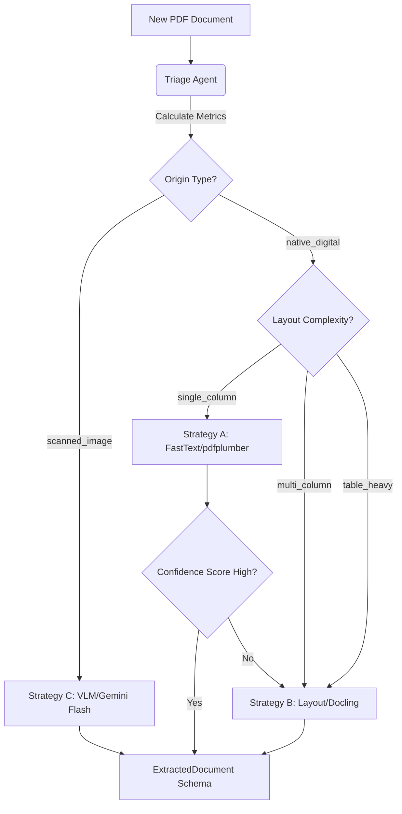
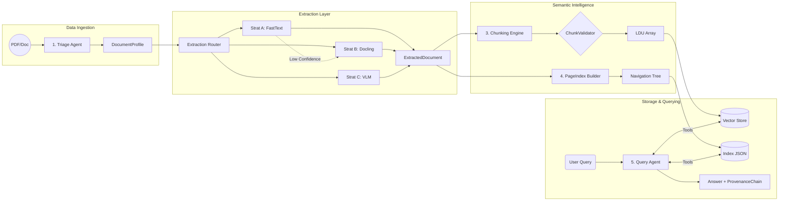

# Domain Notes: The Document Intelligence Refinery

## 1. Corpus Analysis & Threshold Discovery

Before building the extraction engine, we ran extensive empirical analysis on the provided heterogeneous corpus. The goal was to establish reliable, data-driven heuristics to route documents to the most cost-effective extraction strategy.

We ran `pdfplumber` character density and image area analysis across the four document classes (first 10 pages each):

| Document Class               | Example File                  | Avg Char Density (chars/pt²) | Avg Image Area Ratio | Zero-Char Pages | Multi-Col Pages | Tables Detected        |
| ---------------------------- | ----------------------------- | ---------------------------- | -------------------- | --------------- | --------------- | ---------------------- |
| **Class A (Native Digital)** | CBE ANNUAL REPORT 2023-24.pdf | 0.000911                     | 0.3892               | 20%             | 60%             | 0                      |
| **Class B (Scanned)**        | Audit Report - 2023.pdf       | 0.000021                     | 0.9016               | 90%             | 0%              | 0                      |
| **Class C (Mixed)**          | fta_performance_survey...pdf  | 0.004751                     | 0.0007               | 0%              | 100%            | 4                      |
| **Class D (Structured)**     | tax_expenditure...pdf         | 0.003246                     | 0.0043               | 0%              | 90%             | 0 (naive) 29 (Docling) |

### Key Failure Modes Observed

1.  **Invisible/Zero-Width Text (Class A)**: Native PDFs often use images for charts with invisible text layers, leading to layout collapse in naive parsers.
2.  **Pure Scans (Class B)**: Has virtually zero character density (`0.000021`) and >90% image-to-page ratio. Naive extraction returns completely empty strings.
3.  **Complex Multi-Column (Class C & D)**: High character density (`0.003 - 0.004`) but standard `pdfplumber` flattens the columns into incoherent left-to-right sentences.
4.  **Table Collapse**: `pdfplumber`'s naive `.find_tables()` missed almost every table in Class A and D.

### 1.5 Tool Performance Comparison: pdfplumber vs. Docling

To understand the gap between naive text extraction and layout-aware models, we ran Docling on the Class D document (tax expenditure). Note: We ran Docling with OCR disabled on Class C/D to isolate layout performance, and enabled OCR for Class B scanned documents:

- **Table Extraction**: `pdfplumber` found **0** coherent tables using heuristic grid lines. Docling identified **29** tables, preserving complex multi-row headers perfectly in its internal `TableData.grid` structure.
- **Multi-Column Handling (Class C & D)**: `pdfplumber` reads straight across the page, mangling logical boundaries (e.g., reading column 1 line 1, then column 2 line 1). Docling correctly identifies reading order via bounding-box clustering, emitting coherent markdown paragraphs.
- **Image Anchoring**: Docling successfully identified 16 embedded pictures/charts in Class D and anchored them to the correct point in the text stream, whereas `pdfplumber` only extracts floating image coordinates without semantic context.

**Conclusion**: Strategy A (`pdfplumber`) is only safe for highly dense, single-column native text. Any presence of multi-column layouts or tables requires Strategy B (`Docling`).

---

## 2. Confidence Thresholds & Extraction Rules

Based on the empirical data above, we have established the following routing thresholds to be codified in `rubric/extraction_rules.yaml`:

### 2.1 Threshold Justifications

- **Scanned Detection (Triggers Strategy C / VLM)**
  - `avg_char_density < 0.0001` OR `zero_char_pages > 50%` OR `avg_image_area_ratio > 0.8`
  - _Why 0.0001?_ Class B (pure scan) sits at `0.000021`. Class A (native but image-heavy) sits at `0.0009`. Setting the threshold at `0.0001` safely captures true scans without catching native documents that just happen to have large cover images.
- **Simple Native Detection (Triggers Strategy A / Fast)**
  - `avg_char_density > 0.001` AND `multi_col_pages < 30%` AND `tables_detected == 0`
  - _Why these strict constraints?_ Class C sits at `0.0047` density but is 100% multi-column. If we only used density, Class C would route to Strategy A and be destroyed by column-flattening. We must mandate low multi-col presence and zero tables for Strategy A to be safe.
- **Complex Native Detection (Triggers Strategy B / Layout-Aware)**
  - Everything else (e.g., Class A, C, D).

### 2.2 Cost-Quality Tradeoff Analysis

The core of the Refinery's value proposition is avoiding the $0.50/page cost of Vision Language Models unless absolutely necessary.

| Strategy       | Engine       | Estimated Cost / 100 Pages   | Speed / Page | Data Fidelity                                      |
| -------------- | ------------ | ---------------------------- | ------------ | -------------------------------------------------- |
| **A (Fast)**   | pdfplumber   | **$0.00** (Compute only)     | `< 0.1s`     | High (on simple text), Fails on tables/columns     |
| **B (Layout)** | Docling      | **$0.01** (Local ML compute) | `~4.0s`      | High structure, perfect table grids, reading order |
| **C (Vision)** | Gemini Flash | **$0.09** (API)              | `~2.0s`      | Solves handwriting, scans, and broken layouts      |

_Cost Note:_ Based on our corpus, an average page requires ~1,200 tokens. At $0.075 / 1M input tokens via OpenRouter's Gemini Flash, the cost is roughly $0.09 per 100 pages.

_The Escalation Guard_: If Strategy A extracts a page where `char_count < 100` and `image_area_ratio > 0.5`, confidence is considered **LOW**. The financial logic: passing garbage text to an LLM RAG system costs money in embedding, vector storage, and hallucinated answer generation. It is cheaper to spend $0.01 on Strategy B compute upfront than to pollute the vector index.

### 2.3 Edge Case Handling

1.  **True Mixed Documents (50% Scanned / 50% Native)**: The system analyzes page-by-page. A document with a native text body but scanned appendix will route to Strategy B globally, but the `Escalation Guard` will catch the zero-density scanned pages mid-document and escalate _only those specific pages_ to Strategy C.
2.  **Boundary Density (e.g., 0.0005)**: This occurs when a PDF is mostly images but has a tiny native text footer (e.g., a page number). The image ratio (`>0.8`) will override the weak text signal and correctly route to Strategy C.
3.  **Images Containing Tables**: Neither Strategy A nor B can parse text inside a flat image. If Docling identifies a large image block (via `doc.pictures`) but cannot find a table grid, the PageIndex builder flags these sections with `needs_vlm_review: true` for manual inspection or future automated VLM routing.

## 3. Extraction Strategy Decision Tree

---

## 4. Pipeline Architecture Diagram (5-Stage)

---

## 5. Ground Truth Table Annotations

For final verification (Phase 4), we have manually identified the following ground truth tables to test precision/recall:

1.  **Class C (FTA)**: Page 12, Table "Total budget vs. Outturn"
2.  **Class D (Tax)**: Page 23 (labeled 11), Table 5 "Import Tax Expenditure by HS Section"
3.  **Class A (CBE)**: Page 144, "Statement of Profit or Loss"
