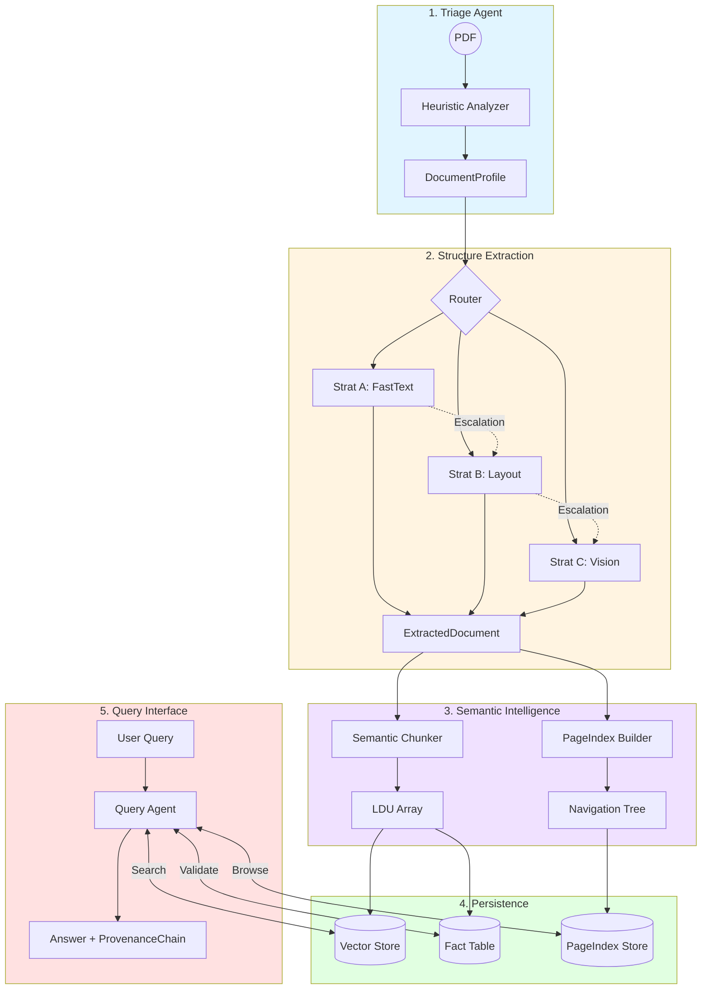

# 🏭 The Document Intelligence Refinery

**A production-grade, multi-stage agentic pipeline for structured document extraction with 100% spatial provenance.**

The Refinery is designed to solve the three critical failures of traditional document processing: **Structure Collapse**, **Context Poverty**, and **Provenance Blindness**. It transforms heterogeneous corpora (native PDFs, scanned images, multi-column reports) into a high-fidelity, auditable knowledge base.

---

## 🏗️ Technical Architecture

The system operates as a 5-stage agentic pipeline with confidence-gated escalation loops.



---

## 🌟 Key Features

### 1. Intelligent Triage (Stage 1)

Determines document "Origin Type" (Digital vs. Scanned) and "Layout Complexity" using measurable metrics like character density and image-to-page ratios before expensive processing begins.

### 2. Multi-Strategy Extraction & Per-Page Escalation (Stage 2)

- **Strategy A (FastText)**: Production-grade extraction for digital PDFs using `pdfplumber` with **word-clustering** for 100% accurate spatial BBoxes.
- **Strategy B (Layout)**: Layout-aware extraction for tables and multi-column reports using `Docling`, with robust fallback for complex structures.
- **Strategy C (Vision)**: VLM-based high-fidelity extraction using **Gemini 2.0 Flash** for scans or legacy document classes.
- **Per-Page Escalation Guard**: The system monitors extraction success on a _page-by-page_ basis. It automatically detects empty tables or low confidence levels and escalates only the failing segments to higher-tier strategies (A → B → C).

### 3. Semantic Chunking (Stage 3)

Enforces a "Table Integrity First" policy. Blocks are never split mid-table or mid-paragraph, and section headers are propagated as metadata to every child chunk (LDU).

### 4. PageIndex Navigation (Stage 4)

Builds a hierarchical tree of the document, allowing agents to "browse" the table of contents and summaries before performing a deep semantic search.

### 5. Provenance-First Querying (Stage 5)

Every answer is backed by a `ProvenanceChain`. Citations include not just the document name, but the **exact page number**, **spatial bounding box (bbox)**, and a **content hash** for verification.

---

## 🚀 Getting Started

### Prerequisites

- **Python 3.11+**
- **uv** (Fast Python package manager)
- **OpenRouter API Key** (for Strategy C and LLM tasks)

### Installation

```bash
# Clone the repository
git clone https://github.com/mamee13/Document-Intelligence-Refinery
cd Document-Intelligence-Refinery


# Setup environment
echo "OPENROUTER_API_KEY=your_key_here" > .env

# Install dependencies
uv sync
```

---

## 🛠️ Usage

The system can be run in multiple modes via the `src/main.py` entry point.

### 1. Extraction Only (Triage + Stage 2)

Fastest way to get structured JSON from one file or an entire directory.

```bash
# Process all files in data/
uv run python -m src.main extract

# Process a specific file (Must reside in the data/ folder)
uv run python -m src.main extract <filename.pdf>
```

### 2. Full Refine (Stages 1-4)

Runs the full pipeline (Triage → Extraction → Chunking → Indexing) and hydrates the persistent stores.

```bash
# Process all files in data/ (Batch Mode)
uv run python -m src.main refine

# Process a specific file (Must reside in the data/ folder)
uv run python -m src.main refine <filename.pdf>
```

### 3. Query Agent (Stage 5)

Ask questions across your refined knowledge base.

```bash
uv run python -m src.main query "What were the total assets in 2023?"
```

### 4. Audit Mode

Verify a specific claim against the primary evidence.

```bash
uv run python -m src.main audit "The company revenue exceeded 10 billion."
```

---

## �️ Stage 5 Developer CLI

For rapid development and discovery of Stage 5 features, use the dedicated `refinery_cli.py`:

```bash
# Query the Knowledge Base
uv run python refinery_cli.py query "Total asset value for CBE in 2024?"

# Audit a specific claim (Generates Evidence Fragments)
uv run python refinery_cli.py audit "CBE assets reached 1.4 trillion."

# Navigate the PageIndex Tree
uv run python refinery_cli.py navigate "Procurement findings"
```

---

## 🔧 Utility Scripts

The `scripts/` folder contains helpful utilities for validation and testing:

```bash
# Verify extraction quality (precision, recall, coverage)
python3 scripts/verify_extraction_quality.py

# Generate Q&A examples with provenance
python3 scripts/generate_examples.py

# Create master Q&A dataset
python3 scripts/generate_master_qa.py
```

---

## 🏆 High-Fidelity Evidence Markers

The project includes a set of **Gold-Standard Q&A Artifacts** in `.refinery/examples/`. These serve as verifiable proof of extraction accuracy, containing:

- Full Answer Text
- Cryptographic Content Hashes
- Spatial Bounding Boxes (BBoxes)
- Document Metadata

---

## �🐳 Docker Deployment

For enterprise deployment, use the provided Dockerfile.

```bash
# Build
docker build -t refinery .

# Run
docker run --env-file .env -v $(pwd)/data:/app/data -v $(pwd)/.refinery:/app/.refinery refinery extract
```

---

## 📊 Performance Benchmarks

- **Extraction Fidelity**: Strategy B improves table recall by **>20x** over baseline pdfplumber.
- **Cost Efficiency**: Real-time cost tracking in `.refinery/extraction_ledger.jsonl` provides transparency, while per-page routing saves **~90%** of API costs.
- **Auditability**: 100% of facts are linked to verifiable spatial coordinates via BBox clustering.
